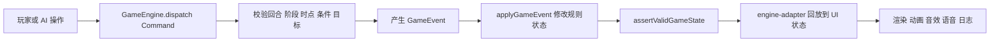
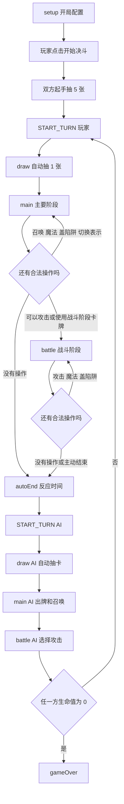
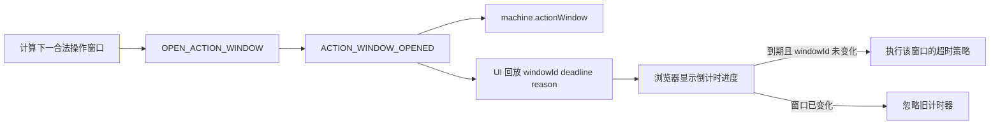
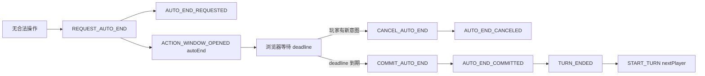
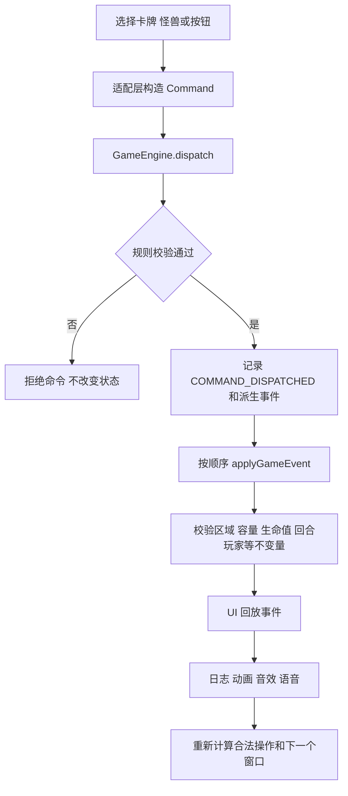
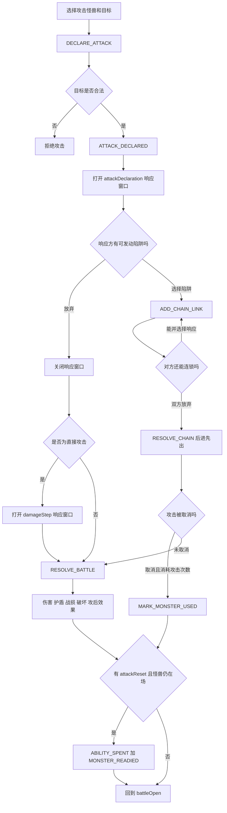
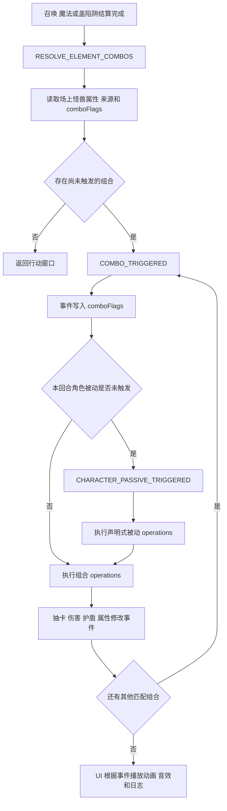

# 游戏流程与状态机

最后更新：2026-06-17

本文描述当前实现中的真实流程。规则变化时，应同时更新对应流程图、阶段表和事件说明。

## 状态所有权

- `GameEngine` 是规则真相来源。
- 卡牌和公共操作不能直接修改规则状态，只能产生事件。
- `engine-adapter` 负责把规则事件投影到当前固定槽位 UI。
- 动画、声音、选中状态和 DOM 不属于核心规则状态。

## 一局游戏

当前没有要求玩家手动点击“结束主要阶段”。状态机会根据当前场面和手牌判断：

- 主要阶段仍有合法操作时继续等待玩家。
- 没有主要阶段操作，但存在攻击或战斗阶段操作时自动进入战斗阶段。
- 所有操作都不可用时进入约 2 秒的 `autoEnd`，给玩家确认场面的时间，再交给 AI。
- 玩家仍可主动“跳过攻击”或“结束回合”。

## 核心阶段

| Phase | Engine Timing | 当前行为 | 主要合法命令 |
| --- | --- | --- | --- |
| `setup` | `setup` | 选择角色、卡组、AI 和测试场景 | 初始化，不允许正式出牌 |
| `draw` | `draw` | 当前回合玩家自动抽 1 张 | `DRAW_CARDS`、`CHANGE_PHASE` |
| `main` | `mainOpen` | 召唤、发动魔法、盖陷阱、切换表示 | `SUMMON_MONSTER`、`ACTIVATE_CARD`、`SET_TRAP`、`CHANGE_MONSTER_MODE` |
| `battle` | `battleOpen` | 攻击，也可发动魔法或盖陷阱 | `DECLARE_ATTACK`、`RESOLVE_BATTLE`、`ACTIVATE_CARD`、`SET_TRAP`、`SKIP_REMAINING_ATTACKS` |
| `end` | `end` | 核心引擎保留的结束阶段 | 当前 UI 通过回合交接完成，尚未作为可见阶段停留 |

通常召唤限制属于玩家回合资源：第一次召唤产生 `NORMAL_SUMMON_USED`，后续召唤必须消费 `extraSummon` 能力。

## UI 行动窗口

`Phase` 表示规则阶段，`actionWindow` 表示当前界面允许玩家进行哪类交互和倒计时。两者不能混用。

| Action Window | 用途 | 默认倒计时 |
| --- | --- | --- |
| `setup` | 开局设置 | 无 |
| `draw` | 自动抽卡等待 | 无 |
| `main` | 主要阶段操作 | 30 秒 |
| `targetSelect` | 选择魔法目标 | 20 秒 |
| `battle` | 攻击及战斗阶段操作 | 30 秒 |
| `response` | 选择是否发动陷阱 | 20 秒 |
| `resolution` | 动画和规则结算，禁止插入普通操作 | 无 |
| `autoEnd` | 无合法操作后的反应时间 | 约 2 秒 |
| `ai` | AI 行动 | 无玩家倒计时 |
| `gameOver` | 胜负已确定 | 无 |

`Phase`、`Timing`、响应窗口、连锁和 `actionWindow` 均由规则事件管理。`turn-state.js` 只负责根据当前牌局计算建议窗口和超时策略；浏览器计时器读取事件中的 `windowId` 与 `deadline` 显示进度，不直接创建或修改窗口状态。

### 自动结束回合事件链

`autoEnd` 不再由 UI 直接写入 `autoEnding`。UI 只负责发现“当前没有合法操作”和启动浏览器计时器；规则状态通过以下命令和事件交接：

手动结束回合直接走 `END_TURN -> TURN_ENDED -> START_TURN nextPlayer`。`TURN_ENDED` 会把核心阶段推进到 `end`，清理响应窗口、连锁、行动窗口和待提交的自动结束请求。

## 单次操作结算

任何失败命令都不应消耗卡牌、攻击次数或能力资源。

## 攻击、响应窗口与连锁

攻击规则要点：

- 对方有怪兽时必须先攻击怪兽，除非怪兽自身或 `directAttack` 能力允许直击。
- 每只攻击表示且未行动的怪兽通常每回合可攻击一次。
- 攻击被某些陷阱取消时，是否消耗攻击次数由陷阱规则决定。
- `attackReset` 在攻击次数被消耗后自动消费；攻击怪兽仍在场时产生 `MONSTER_READIED`。
- “跳过攻击”通过 `SKIP_REMAINING_ATTACKS` 将当前可攻击怪兽标记为已行动，清空攻击重置和直击许可，并授予本回合 `skipAttackLock`。新召唤怪兽也不能绕过该锁。

## 连锁数据

响应窗口至少保存：

- 当前拥有响应优先权的玩家。
- 触发时点和恢复时点。
- 触发事件 ID。
- 攻击者、原目标、直击目标等上下文。
- 当前连锁列表。

连锁项通过 `CHAIN_LINK_ADDED` 和 `CHAIN_LINK_COMMITTED` 建立，双方都放弃继续响应后，由 `RESOLVE_CHAIN` 按后进先出顺序结算。

## 属性组合与角色被动

召唤、发动魔法或盖放陷阱完成后，UI 只负责派发一次组合检查命令。组合条件、每回合标记和实际效果均由引擎结算。

- 组合定义位于 `src/combos.js`，条件和效果均为声明式数据。
- `COMBO_TRIGGERED` 是 `comboFlags` 的唯一写入来源。
- `CHARACTER_PASSIVE_TRIGGERED` 是 `comboThisTurn` 的唯一写入来源，保证同一回合只触发一次角色被动。
- 角色被动存放在玩家规则状态的 `comboPassive.operations` 中，不允许自由函数直接修改状态。
- 多个组合同时满足时按定义顺序结算；角色被动只跟随第一个组合触发一次。

## 文档维护规则

以下变化必须同步更新本文：

1. 新增、删除或改变 `Phase`、`Timing`、`actionWindow`。
2. 改变回合自动推进条件或倒计时。
3. 新增响应时点、连锁规则或优先权规则。
4. 改变攻击次数、召唤次数、能力持续时间等核心资源。
5. 新增会改变主流程的持续效果或特殊胜利条件。

规则实现仍遵循 [RULE_ENGINE.md](RULE_ENGINE.md) 中的测试优先、命令、事件和状态校验约束。
